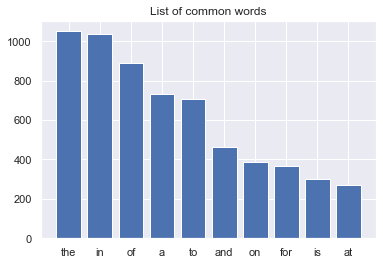
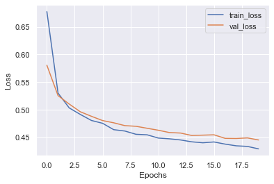
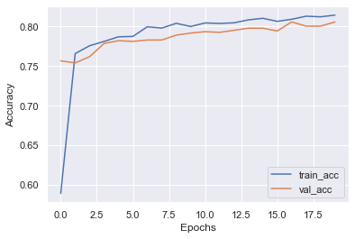

# Project Overview
- Created a Deep Learning model that classifies a tweet into Disaster or not Disaster based on the textual data using Natural Language Processing.

# Resources Used
- Packages: pandas, numpy, sklearn, Tensorflow, keras, matplotlib, seaborn, nltk.
- Dataset on Kaggle: https://www.kaggle.com/c/nlp-getting-started/data

# Exploratory Data Analysis (EDA)
- Plotted countplot for Dister vs. Not Dister
- 

- Plotted Number of Characters in tweets.

- Plotted CountPlot of top most Common Words in dataset text with target variable.

 

# Data Cleaning
- Removing special character, html tages, emojies, urls and numbers using regular expression
- Converting the entire sms into lower case
- Tokenizing the sms by words
- Removing the stop words
- Building a corpus of tweets

# Model Building and Evaluation
- Used GloVe for Transfering Tokenized text to vector formate
- Building using Embedding and LSTM : 0.8056

- Plot of Loss and Accuracy of model

 

