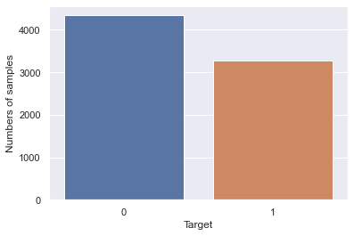

# Project Overview
- Created a Deep Learning model that classifies a tweet into Dister or not Dister based on the textual data using Natural Language Processing.

# Resources Used
- Packages: pandas, numpy, sklearn, Tensorflow, keras, matplotlib, seaborn, nltk.
- Dataset on Kaggle: https://www.kaggle.com/c/nlp-getting-started/data

# Exploratory Data Analysis (EDA)
- Plotted countplot for Dister vs. Not Dister
- 

- Plotted Number of Characters in tweets.

- Plotted CountPlot of top most Common Words in dataset text.

  

# Data Cleaning
- Removing special character and numbers using regular expression
- Converting the entire sms into lower case
- Tokenizing the sms by words
- Removing the stop words
- Lemmatizing the words
- Joining the lemmatized words
- Building a corpus of messages

# Model Building and Evaluation
- Building using Multinomial Naive Bayes : 0.97
- Building using Decision Tree:  0.95
- Building using Random Forest: 0.97

# Used Model 
- Random Forest: 0.97

# Model Prediction 

